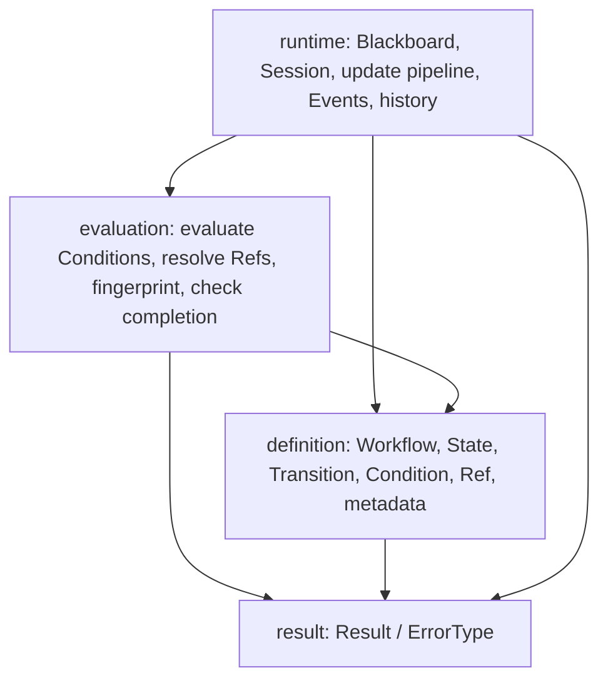
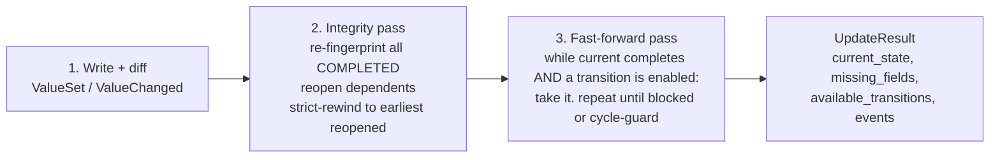

# markov-protocols — Design & Architecture

> A deterministic finite state machine that guides AI agents through workflows.
> This document is the agreed blueprint: the models, the interfaces, the patterns,
> the extension points, and the build plan.

---

## 1. Purpose & the boundary that defines the whole project

We model a workflow as a state machine. An AI agent reads its **current state** for
guidance and reports what it learned; the machine deterministically decides where the
workflow goes next. The stochastic parts (the LLM, tool execution, retrieval, sending
webhooks) live in the **host**; the machine is the **deterministic referee**.

**The Two-Rule Boundary — memorize this, every design decision derives from it:**

1. The machine **never executes anything** — no LLM call, no tool, no I/O, no side effect.
   It *declares* what should happen and *surfaces* it to the host; the host acts.
2. There are exactly **two pure ways to touch the shared data (`Blackboard`)**:
   - a **`Condition`** reads the Blackboard → returns a `bool` (are we done? is this path open?)
   - a **`Ref`** reads the Blackboard → returns a `value` (bind a collected value into a payload)

   Both are pure and deterministic. Nothing else reads or writes the Blackboard implicitly.

**Determinism guarantee:** given the same `Workflow` definition and the same `Blackboard`,
the machine always produces the same verdict — current state, completions, reopenings,
available transitions, and directives. Same inputs → same guidance, always.

---

## 2. Vocabulary (the naming standard)

Names describe the **domain**, not the implementation. A developer should learn this
table once and read the whole codebase.

| Term | Meaning |
|---|---|
| **Workflow** | The authored graph — all states + transitions. The immutable *definition*. Has a stable identity (`name`). |
| **State** | One step in a workflow. Its `id` is the slug of its `title`. |
| **Transition** | A directed link from one state to another, optionally **guarded**. |
| **Requirement** | A data field a state needs before it completes. |
| **Condition** | A boolean rule over the `Blackboard` (typed; our small closed vocabulary). |
| **Guard** | A `Condition` attached to a transition — it gates a path. |
| **Ref** | A typed reference to a `Blackboard` field — binds a collected value into a payload. |
| **Blackboard** | The shared, deterministic record of everything collected in one conversation. (Named for the blackboard pattern — a shared space the host writes and the machine reads. *Not* the LLM's token context.) |
| **Session** | One conversation's live run of a Workflow (`Workflow` + `Blackboard` + `current_state` + `history`). Carries a unique random `id`. The main developer-facing object. |
| **Event** | An entry in the append-only audit log (`StateCompleted`, `StateReopened`, `TransitionTaken`, `ValueSet`, `ValueChanged`, `ActionExecuted`). |
| **history** | The append-only list of `Event`s — the audit trail and the RL trajectory. |
| **Directive** | The host-actionable, fully-materialized instruction a state surfaces while active (e.g. a resolved webhook payload). `None` when the state just waits on the user. |
| **status** | Per-state lifecycle: `PENDING → ACTIVE → COMPLETED`, plus `REOPENED`. |
| `session.id` | A unique random identifier (uuid4) generated when the Session starts — correlates history, logs, and persistence. |
| `session.is_finished` | Derived: the current state completed and has no outgoing transitions. |

---

## 3. Architecture — four layers, one direction of dependency



- **Definition** — pure Pydantic models. Immutable, serializable, no behavior beyond
  validation. This is what a user (or a database) authors.
- **Evaluation** — pure, stateless functions. Given a definition + a `Blackboard`, compute
  facts (does this Condition hold? what does this Ref resolve to? has the fingerprint
  changed?). No mutation, no I/O — this is where determinism is enforced.
- **Runtime** — the only stateful layer. Holds a `Blackboard`, runs the `update()` pipeline,
  appends `Event`s. Uses evaluation; never bypasses it.
- **result** — cross-cutting error type (see §8).

Dependencies point downward only. The runtime never leaks into the definition; the
definition never imports the runtime. That is what keeps the pieces reusable.

---

## 4. The models (definition layer)

Sketches — shapes, not final code.

### Metadata (typed-but-open — validates shape, contents stay opaque)

```python
class StateMetadata(StrictOpenModel):      # model_config: extra="allow"
    tools:      dict[str, Any] = {}
    prompts:    dict[str, Any] = {}
    guardrails: dict[str, Any] = {}

class TransitionMetadata(StrictOpenModel):
    events:    dict[str, Any] = {}
    resources: dict[str, Any] = {}
    reward:    float = 1.0     # ge=0.0 — experimental (RL door)
```

### Condition (our closed, typed vocabulary — a discriminated union on `op`)

```python
# leaves
Exists(op="exists", field)
Eq(op="eq", field, value)   /  Ne(op="ne", ...)
In(op="in", field, value: list)
Regex(op="regex", field, value: str)
Compare(op in {gt,gte,lt,lte}, field, value)
# combinators (recursive)
All(op="all", of: list[Condition])
Any(op="any", of: list[Condition])
Not(op="not", of: Condition)
```

### Ref (the only value-binding primitive)

```python
class Ref(BaseModel):
    field: str            # a Blackboard key
# usable anywhere in a payload: {"to": Ref(field="email")}
```

### State — the interface every step implements (see §5)

```python
class State(StrictModel, ABC):
    id: str               # = slug(title), assigned at compile
    title: str
    metadata: StateMetadata = StateMetadata()

    @abstractmethod
    def completion(self) -> Condition: ...             # when am I done?
    def depends_on(self) -> set[str]: ...              # fields that reopen me if changed
    def directive(self, bb: Blackboard) -> Directive | None: ...  # host action while active
```

Concrete states (each is a small piece; adding one does not touch the engine — §5):

```python
class DataCollectionState(State):
    type: Literal["DATA_COLLECTION"]
    requires: list[Requirement]
    # completion()  = All(Exists(f) for each required field)
    # depends_on()  = the required fields
    # directive()   = None  (the agent collects, guided by metadata.prompts)

class ActionExecuteState(State):
    type: Literal["ACTION_EXECUTE"]
    payload: dict[str, Any]        # literals + Refs
    result_field: str              # where the host writes the outcome
    # completion()  = Exists(result_field)
    # depends_on()  = the Refs inside payload  (its `consumes` set)
    # directive()   = the payload with every Ref resolved against the Blackboard

class HumanHandoffState(State):
    type: Literal["HUMAN_HANDOFF"]
    resolution_field: str
    notify: dict[str, Any]         # literals + Refs
    # completion()  = Exists(resolution_field)
    # directive()   = the resolved notification
```

### Transition & Workflow

```python
class Transition(StrictModel):
    source_id: str
    target_id: str
    guard: Condition | None = None
    priority: int = 0
    metadata: TransitionMetadata = TransitionMetadata()

class Workflow(StrictModel):
    name: str
    states: tuple[State, ...]
    transitions: tuple[Transition, ...]
    initial_id: str

    @classmethod
    def compile(cls, name, states, transitions, initial) -> "Result[Workflow, str]":
        # Validates and readies the graph for execution: unique title-slugs, endpoints
        # exist, initial exists, deterministic transition ordering. A compiled Workflow
        # is guaranteed runnable. Returns Result — never raises here.
        ...
```

`compile()` is the word on purpose: it does not just build an object, it **proves the graph
is ready to be executed**. If it returns `ok`, a `Session` can run it without surprises.

---

## 5. The State interface is the extension seam (Open/Closed)

The engine must **never** branch on `type`. It only ever calls the three interface
methods. That single rule is what makes the project extensible:

| Engine needs to know… | It asks the state… | Never does |
|---|---|---|
| Is this step done? | `state.completion()` → evaluate against the Blackboard | `if type == "DATA_COLLECTION"` |
| What reopens this step? | `state.depends_on()` | inspect subtype fields |
| What must the host do now? | `state.directive(bb)` | know what a webhook is |

**Adding a new state type** (in this project *or a downstream one*) is a closed, four-step
recipe with zero engine edits:

1. Subclass `State`, add a unique `type` Literal.
2. Implement `completion()`, `depends_on()`, `directive()`.
3. Register it: `state_registry.register(MyState)` (enables (de)serialization).
4. Write its tests.

This is **Strategy + Registry**: behavior is polymorphic behind `State`; the registry maps
`type` tags to classes so a Workflow round-trips through JSON even with third-party states.
Built-in types are also registered this way — no special-casing.

---

## 6. Conditions & Refs — the only Blackboard touchpoints

- **Condition evaluation** is a **dispatch table** — `op` name → a tiny pure function.
  Adding an operator is one entry + one test; the evaluator is closed to modification.
  We own a *small closed vocabulary* (not an open expression language) on purpose:
  it validates at authoring time, serializes to JSON/DB, and is safe (no `eval`). CEL /
  JSONLogic remain an escape hatch only if expression power ever outgrows this.
- **Ref resolution (materialization)** walks a payload, replaces every `Ref` with its
  Blackboard value, and returns a fully-resolved copy. Pure substitution — in-scope because
  it is deterministic and does no I/O. If a `Ref` can't resolve, materialization **fails
  loudly** (returns the missing field) — a webhook can never go out with a blank value.
- The set of `Ref`s a state uses **is** its `depends_on` / `consumes` set — one concept,
  three jobs: data binding, precondition, and invalidation edge.

---

## 7. Runtime — Blackboard, Session, and the `update()` pipeline

`Session` is the **facade** developers use. Almost everything else is internal.

```python
session = Session.start(workflow)                    # generates session.id (uuid4)
session = Session.resume(workflow, blackboard, history, id=...)  # rehydrate a saved run
result  = session.update({"email": "pedro@..."})     # the one input verb
session.id                   # unique run identifier
session.current_state        # where we are
session.history              # the audit trail
session.is_finished          # derived
```

### `update(values)` is a *settle*, not a *step* — three passes, one path

Every input — a single reply, a whole form pasted at once, or a correction — goes through
the same pipeline. One path = no blind spots.



- **Completion** — the engine evaluates `current_state.completion()` against the Blackboard.
  Same mechanism for every state kind; only the *producer* of the data differs (LLM for
  collection, host for actions/handoff).
- **Transition selection** — a transition is enabled when its source is `COMPLETED` and
  its `guard` (if any) holds. Ties are broken by `(-priority, declaration_index)` — a total
  order, so the pick is always deterministic. This is how branching works (e.g.
  `intent == "buy"` vs `intent == "support"`).
- **Reopen / strict rewind (v1)** — on any `ValueChanged`, re-fingerprint every COMPLETED
  state; a changed fingerprint → `REOPENED`. Rewind `current_state` to the earliest
  reopened state *in this session's actual trajectory* (read from `history`); reset later
  states to `PENDING`. **Blackboard values are preserved** — no re-asking data that didn't
  change; unaffected states auto-complete on the re-walk. (Scoped invalidation via
  `depends_on` is the documented later upgrade.)
- **Side effects & compensation** — the engine surfaces a `Directive` (materialized) and
  records `ActionExecuted` when the host reports a result. Reopening a state that already
  executed is flagged (`had_executed=True`) so the host can compensate. The engine never
  pretends the outside world is reversible.
- **Termination** — during one `update()`, data is fixed, so a state is entered at most
  once; hitting an already-visited state stops the fast-forward. Always terminates.

---

## 8. Error handling — `Result` for outcomes, raise for impossible objects

- **Structural invariants → raise** at construction. Pydantic validators reject a malformed
  `Transition` or `Condition`; such an object must not exist.
- **Operational outcomes → `Result[T, E]`.** `Workflow.compile()` and `Session.update()`
  return `Result` because failure is an expected, handleable path (unknown state, missing
  Ref, ambiguous definition). No exceptions for control flow.

`ErrorType` stays coarse and transport-agnostic (`NOT_FOUND`, `VALIDATION_ERROR`,
`CONFLICT`, …) so the same result travels cleanly across the projects that consume us.

---

## 9. Design patterns & SOLID — deliberate, not decoration

| Concern | Pattern | Where |
|---|---|---|
| New state types without engine edits | **Strategy + Registry (Plugin)** | `State` interface + `state_registry` |
| New condition operators | **Dispatch table** | `conditions/evaluate.py` |
| Simple, discoverable runtime API | **Facade** | `Session` |
| Ergonomic authoring | **Builder** (optional sugar over models) | `WorkflowBuilder` |
| JSON/DB round-trip with subtypes | **Discriminated union + registry** | `state.type` tag |
| Predictable definitions | **Immutable value objects** | definition layer |
| Control flow without exceptions | **Result / railway** | `result.py` |
| Audit, resume, RL trajectory | **Event log (event-sourcing-lite)** | `history` |

| SOLID | How we honor it |
|---|---|
| **S**RP | Each module has one job: evaluate conditions, resolve refs, run a session. |
| **O**CP | Engine closed; state types and operators open via registry / dispatch table. |
| **L**SP | Every `State` is substitutable behind three methods; the engine treats them uniformly. |
| **I**SP | The engine depends on a *tiny* state interface, not on concrete subtype fields. |
| **D**IP | Runtime depends on `State`/`Condition` abstractions, not concrete states. |

---

## 10. Package layout — the building pieces

```
src/markov_protocols/
    __init__.py            # curated public API (Workflow, Session, states, Condition, Ref, Result)
    result.py              # Result, ErrorType                         [done]
    conditions/
        models.py          # Condition discriminated union
        evaluate.py        # pure dispatch-table evaluator
    references.py          # Ref + materialize()
    definition/
        metadata.py        # StateMetadata, TransitionMetadata
        state.py           # State interface, status, Directive
        states/            # concrete states — one file each (building pieces)
            data_collection.py
            action_execute.py
            human_handoff.py
        transition.py      # Transition
        workflow.py        # Workflow.compile() + validation
        registry.py        # state_registry (extension seam)
    runtime/
        blackboard.py      # Blackboard
        events.py          # Event union + history
        fingerprint.py     # canonical hashing
        session.py         # Session facade + update() pipeline
tests/
    ... one test module per unit above
```

The public surface a developer imports is small: **author with `Workflow` + state types,
run with `Session`, express logic with `Condition` + `Ref`, handle outcomes with `Result`.**
Everything else is internal machinery they never need to see.

---

## 11. Build plan — vertical slices, each shippable and tested

| Slice | Delivers | Status |
|---|---|---|
| **1 — Definition** | `conditions/` (models + evaluate), `references.py`, metadata, `State` interface + the three concrete states, `Transition`, `Workflow.compile()` validation, `registry`. Fully unit-tested. **No runtime.** | ✅ done |
| **2 — Runtime core** | `Blackboard`, `Event`s + `history`, `Session.start/update` with the completion + fast-forward passes (no rewind yet), `Directive` materialization. | ✅ done |
| **3 — Integrity** | `REOPENED`, strict rewind, `ValueChanged` cascade, `ActionExecuted` + `had_executed` compensation flag. | ✅ done |
| **Later (non-blocking)** | scoped invalidation via `depends_on`, `WorkflowBuilder` sugar, sub-workflow state type, reward/trajectory export. | pending |

Each slice compiles, passes `ruff` + `mypy --strict` + `pytest`, and leaves the module
usable by a downstream project.

**Two refinements made while building Slice 3 (kept the design, simplified the mechanism):**

- **Reopen order is read from `history`, not a stored fingerprint.** A state reopens when a
  field it `depends_on()` was overwritten (a `ValueChanged`); the *earliest* reopened state is
  found from the order `StateCompleted` events appear in `history`. No parallel trajectory list,
  no hashing — the log is the single source of truth. (A fingerprint would only be needed to
  detect changes *across* a resume boundary; add it there if ever required.)
- **A new `State.produces()` method** names the fields a state *outputs* (an action's
  `result_field`), distinct from `depends_on()` (its inputs). On reopen those outputs are cleared,
  so an action that already ran is forced to re-run with the corrected inputs — and `had_executed`
  is simply "this reopened state produces something", needing no separate bookkeeping.

---

## 12. How to extend (the playbook we promise developers)

- **New state type:** subclass `State`, add a `type` Literal, implement the three methods,
  `state_registry.register(...)`, test. No engine change.
- **New condition operator:** add a leaf model to the union, add one function to the
  dispatch table, test. No engine change.
- **New side effect (webhook, redis dispatch, …):** it's a payload with `Ref`s on an
  `ActionExecuteState` (tracked/reopenable) or a transition `event` (fire-and-forget).
  You never write engine code — you author data.
- **Chain to another workflow:** put opaque `handoff` metadata on a terminal state; the
  host starts the next `Session` with the ported `Blackboard`.
```
